<h3><code>francescomonticone@github ~ $ whoami</code></h3>

<table>
<tr>
<td valign="top"></td>
<td valign="top"></td>
</tr>
</table>

I'm a Master's student in Computer Science and Engineering at Politecnico di Milano, with a background in Computer Engineering and a strong interest in Artificial Intelligence, Machine Learning, Cybersecurity, Software Engineering, and Computer Systems. I enjoy understanding how things work at a deeper level and turning theoretical knowledge into practical projects. I consider myself a curious and detail-oriented person who is always looking to learn something new and improve. I'm currently looking for opportunities to keep learning and tackle real-world problems through professional experiences, research projects, and collaborations in software, AI/ML, cybersecurity, and systems.

 
 

<h3><code>francescomonticone@github ~ $ ./contributions.sh</code></h3>

 
 

<h3><code>francescomonticone@github ~ $ ./links.sh</code></h3>

 

